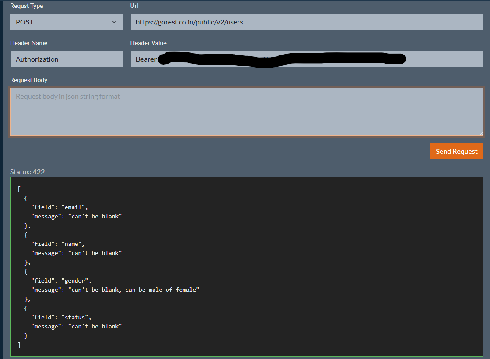
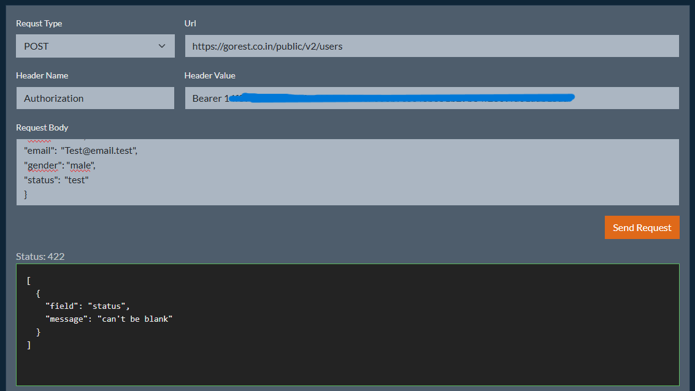
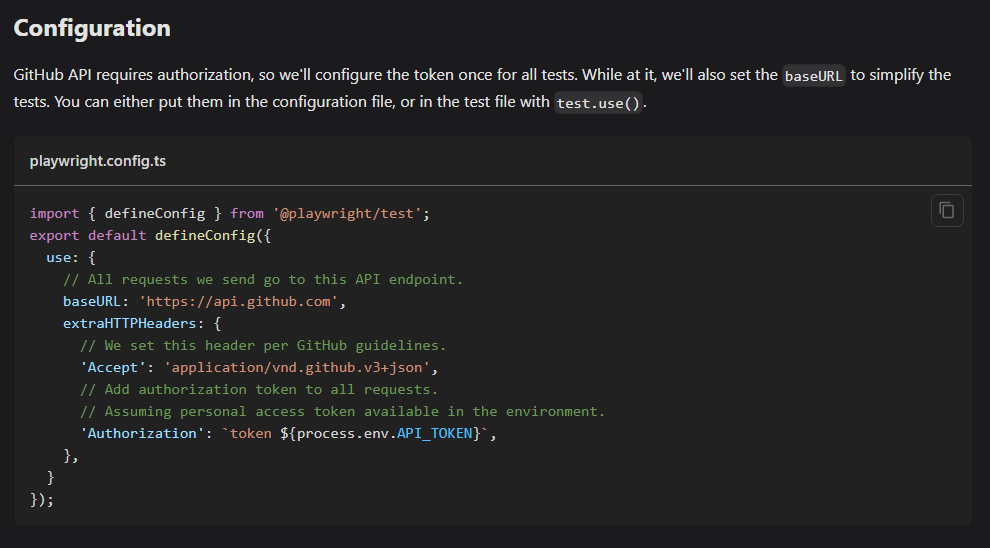

# Rest API testing

## Possible errors found

### Status field

When creating users, if you don't provide any field, the response states that fields cannot be blank and, specifically for gender, that it needs to be male or female.

It is pretty clear that for field gender, anything outside male or female are invalid, but for status, the having into account the error message, it seems it allow anything that is not an empty string. However, if we try to send something different to active or inactive, the response will show the same issue.

I've done my tests having this into account and treating this field as it only accepts active and inactive as valid values as it's mandatory to have all tests to run green, but I think this is an issue in the API. It should be found by testing if I made them to check that any non-empty string should create a valid user, which will result in the test failing.

I've tried with different values and also checked the GET results, and I only found active and inactive as valid values.

## Issues found during development

### Default config not working for auth token

According to [documentation](https://playwright.dev/docs/api-testing#configuration), you can have the bearer token stored in file [playwright.config.js](./playwright.config.js), under the `use` block adding `extraHTTPHeaders`.

No matter what I tried, the `APIRequestContext` always received a 401 when I needed authentication, so I loaded it as part of the tests.

## Credits

- [HttpStatusCode](https://gist.github.com/scokmen/f813c904ef79022e84ab2409574d1b45)
